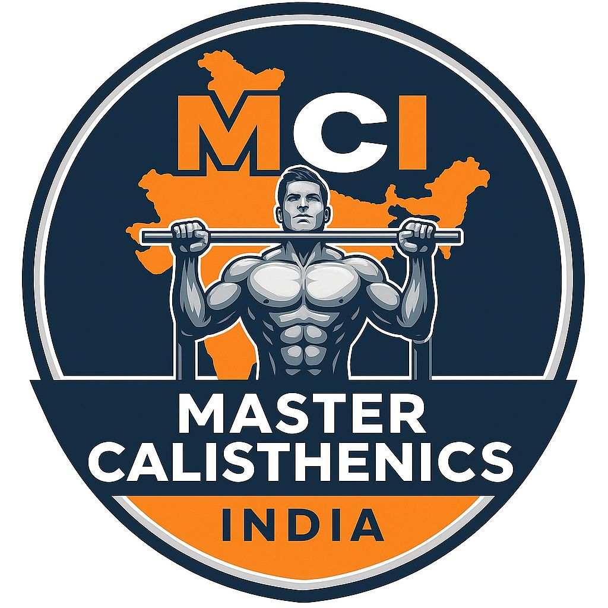

# 🤸 Master Calisthenics India

[](https://opensource.org/licenses/MIT)
[](https://github.com/iammsp-star/calisthenics-india-website)
[](https://www.mastercalisthenicsindia.com)

Welcome to the official repository for the **Master Calisthenics India (MCI)** website platform. This site serves as the digital home of the premier calisthenics and bodyweight training gym in Mira Road & Mira Bhayandar, Mumbai. It provides customer landing pages, guide articles, online coaching sales pipelines, and an administrative coach portal to manage member subscriptions.

 *(Placeholder for official Open-Graph Banner)*

---

## 🚀 Key Features

*   **🔒 Secure Coach Dashboard**: Administrative portal (`coach-dashboard.html`) powered by Supabase Auth, allowing trainers to track membership status, view student details, and filter active vs. expired accounts.
*   **🚦 Traffic-Light Tenure Status**: Visual alerts (🔴 Red for expired, 🟡 Yellow for 1-5 days left, 🟢 Green for active) mapping client membership tenure to streamline renewals.
*   **🤖 AEO & GEO SEO Strategies**: Structured headings utilizing voice-search query formats, 200–400 word semantic text blocks for RAG/LLM engine indexing, and direct Answer-First lead paragraphs.
*   **📊 JSON-LD Schema Markup**: Advanced Schema.org graphs embedded in page headers (`GymOrFitnessCenter`, `HowTo`, `Service`, `Article`, and `FAQPage`) to align with Search Generative Experience (SGE).
*   **💬 WhatsApp Notification Flow**: Backend edge functions and cron jobs structured to automatically dispatch fee reminders to members with 3 days remaining on their package.
*   **💳 Payment Integrations**: Direct payment portal utilizing Razorpay checkout APIs for membership renewal and trial class bookings.

---

## 🛠️ Tech Stack

*   **Frontend Core**: Vanilla HTML5, Vanilla JavaScript (ES6 Modules)
*   **Styling**: Custom CSS3 design system (variables, Montserrat & Inter typography, responsive fluid layouts)
*   **Database & Auth**: Supabase (PostgreSQL database, Supabase Auth client, Edge Functions)
*   **Payments**: Razorpay Checkout SDK
*   **Deployment**: GitHub Pages (static front-end hosting) with custom DNS mapping

---

## 📂 Project Architecture

A tree-style overview of the main directory structure:

```bash
calisthenics-india-website/
├── admin/
│   └── dashboard.html       # Coach administration panel (legacy sub-route)
├── assets/
│   ├── logo.jpg             # Branding logo JPG
│   ├── logo.png             # Branding logo PNG (transparent)
│   └── payment-qr.jpg       # Static UPI payment QR code
├── docs/
│   └── ...                  # System documentation and manuals
├── scripts/
│   ├── insert.sql           # SQL schema initialization scripts
│   └── migrate.mjs          # Spreadsheet-to-Supabase migration script
├── wiki/
│   ├── Business-Logic.md    # Operational business guides
│   ├── SEO-Strategy.md      # AEO/GEO SEO and schema specifications
│   └── Home.md              # Wiki index page
├── index.html               # Main website landing page
├── coach-login.html         # Coach secure authentication portal
├── coach-dashboard.html     # Active Coach Dashboard portal (root path)
├── book-trial.html          # Free trial session booking form
├── calisthenics-for-beginners.html # Beginner's progression guide & workout split
├── calisthenics-training-india.html # Street workout guide & academies in India
├── online-coaching.html     # Virtual remote coaching packages page
├── pay.html                 # Membership renewal form
├── payments.js              # Razorpay integration script
├── styles.css               # Central custom CSS stylesheet
├── supabase.js              # Supabase API client setup
└── package.json             # NPM dependencies
```

---

## 💻 Getting Started (Installation)

Follow these step-by-step instructions to get a local copy of this project up and running.

### Prerequisites

You need [Node.js](https://nodejs.org/) installed locally (version 18+ recommended) to run helper scripts and local server utilities.

### 1. Clone the Repository
```bash
git clone https://github.com/iammsp-star/calisthenics-india-website.git
cd calisthenics-india-website
```

### 2. Install Dependencies
```bash
npm install
```

### 3. Setup Supabase Credentials
Create a `.env` file in the root directory (or update the API keys in your client configuration):
```env
SUPABASE_URL=your_supabase_project_url
SUPABASE_ANON_KEY=your_supabase_anon_public_key
```

### 4. Run a Local Development Server
Because the project uses ES6 Modules (e.g. `import { supabase } from './supabase.js'`), files must be served over an HTTP server rather than opened as static local files.

**Using Node (npx):**
```bash
npx http-server -p 8000
```

**Using Python:**
```bash
python -m http.server 8000
```

Open your browser and navigate to `http://localhost:8000` to preview the site.

---

## ⚖️ License

Distributed under the MIT License. See [LICENSE](LICENSE) for more information.
